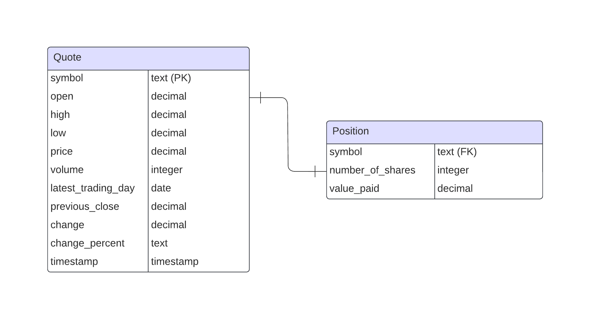

# Stock Quote App

## Introduction

The Stock Quote App is designed to simulate a simple stock wallet, enabling users to track and manage their stock
investments. Utilizing the [Alpha Vantage API](https://rapidapi.com/alphavantage/api/alpha-vantage), the app retrieves
real-time stock data, while a PostgreSQL database persists records of purchased stocks. It uses the DAO design
pattern to separate data access logic from business logic, features logging with SLF4J and Log4j, and is fully
dockerized for straightforward deployment and consistent environments.

## Setup and Usage

*Prerequisites:* psql, docker need to be installed

#### Using [`stockapp`](stockapp) script (MacOS/Linux)

``` bash
# Create pre-populated database container
./stockapp setup-db

# Run application within a container
./stockapp run
```

---

#### [`stockapp`](stockapp) usage

```bash
./script.sh {setup-db|start-db|stop-db|run} [path]
```

- `setup-db [path]`: Initializes and runs a PostgreSQL container (`stockapp-db`).
    - Maps storage to `[path]` or defaults to `$(pwd)/pgdata`.
    - Database can be accessed via exposed `5433` port.


- `start-db`: Starts an existing `stockapp-db` container.


- `stop-db`: Stops the `stockapp-db` container.


- `run`: Runs the stock application container.
    - Maps logs to `./logs` on the host machine.
    - removes container after execution

## Implementation

### ER Diagram



### DAO Design Pattern

The **DAO** design pattern allows for separation between business logic and data access in the database.

This design pattern is implemented in this project through two classes that handle interfacing with their respective
tables in the database. These are our Data Access Objects (DAO):
[`PositionDao`](src/main/java/ca/jrvs/apps/stockquote/dao/PositionDao.java)
and [`QuoteDao`](src/main/java/ca/jrvs/apps/stockquote/dao/QuoteDao.java).

Data Transfer Objects (DTOs) are simple, serializable objects used to transfer data between different layers of an
application, such as from a database to the user interface. There are also two classes that serve as Data Transfer
Objects (DTO) for the same respective tables:
[`Position`](src/main/java/ca/jrvs/apps/stockquote/dto/Position.java)
and [`Quote`](src/main/java/ca/jrvs/apps/stockquote/dto/Quote.java).

## Testing

I used JUnit 4 for structuring tests and Mockito 5 for mocking dependencies to perform integration and unit tests.I
conducted unit and integration testing on the methods within the following classes:

| Class Name      | Associated Test Files                                                                                                                                                                                    |
|-----------------|----------------------------------------------------------------------------------------------------------------------------------------------------------------------------------------------------------|
| PositionService | [PositionService_UnitTest.java](src/test/java/ca/jrvs/apps/stockquote/PositionService_UnitTest.java), [PositionService_IntTest.java](src/test/java/ca/jrvs/apps/stockquote/PositionService_IntTest.java) |
| QuoteService    | [QuoteService_UnitTest.java](src/test/java/ca/jrvs/apps/stockquote/QuoteService_UnitTest.java), [QuoteService_IntTest.java](src/test/java/ca/jrvs/apps/stockquote/QuoteService_IntTest.java)             |
| QuoteDao        | [QuoteDaoTest.java](src/test/java/ca/jrvs/apps/stockquote/dao/QuoteDaoTest.java)                                                                                                                         |
| PositionDao     | [PositionDaoTest.java](src/test/java/ca/jrvs/apps/stockquote/dao/PositionDaoTest.java)                                                                                                                   |
| QuoteHttpHelper | [QuoteHttpHelperTest.java](src/test/java/ca/jrvs/apps/stockquote/QuoteHttpHelperTest.java)                                                                                                               |

*The database Docker container is initialized with preloaded quote data to ensure that the necessary
data is available for testing purposes.*

## Deployment

Docker containers package both the PostgreSQL database and the Java application for streamlined deployment. The stockapp
script pulls and runs these containers from Docker Hub, facilitating easy integration and testing.

See [micuzo001/stockapp](https://hub.docker.com/repository/docker/micuzo001/stockapp/general) |
[micuzo001/stockapp-db](https://hub.docker.com/repository/docker/micuzo001/stockapp-db/general)

## Potential Improvements

Since multiple containers are being used, we could use `Docker Compose` to manage and orchestrate them.