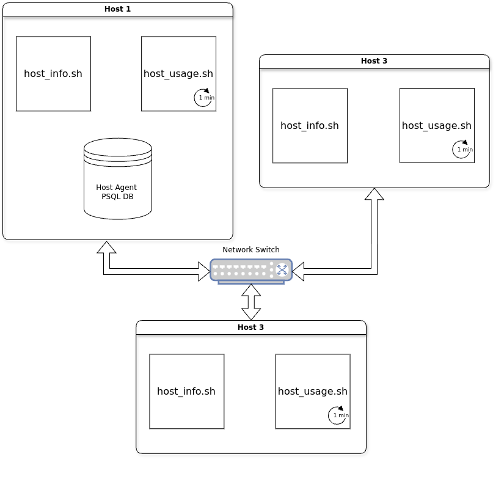

# Linux Cluster Monitoring Agent

## Introduction
The Linux Cluster Administration (LCA) team at Jarvis manages a Linux cluster of
10 nodes. This project aims to help the team collect hardware specifications 
and usage data of each node.

Hardware and usage data are collected using two respective Bash scripts. This data
is then persisted into a PostgreSQL database running in a Docker container.

## Setup
```python
# Prerequisites-----------------------------
# Both docker and psql need to be installed
# ------------------------------------------
```
Create a PostgreSQL Docker instance and set a psql superuser and password:
``` bash
scripts/psql_docker.sh create <pg_user> <pg_password>
```
Create the `host_agent` database with `host_info` and `host_usage` tables:
```bash
psql -h <pg_host> -U <pg_user> -f sql/ddl.sql
```
Store host information in the database **(this should only be done once)**:
```bash
scripts/host_info.sh <pg_host> <pg_port> <db_name> <pg_user> <pg_password>
```
Create a cron job to store usage data **every minute**:
```bash
crontab -e
# In the text editor type
* * * * * bash path/to/project/root/scripts/host_usage.sh <pg_host> <pg_port> <db_name> <pg_user> <pg_password> &>> /tmp/host_usage.log 
```

## Architecture


## Implementation

### Database model

There are two tables to store the host info and host usage data.

---
`host_info` *columns and sample data* || *[key] and (unit) included for clarity*

| id [pk] | hostname               | cpu_number | cpu_architecture | cpu_model                     | cpu_mhz    | l2_cache | timestamp           | total_mem |
|---------|------------------------|------------|------------------|-------------------------------|------------|----------|---------------------|-----------|
| 1       | desktop-north-america  | 2          | x86_64           | Intel(R) Xeon(R) CPU @2.20GHz | 2200 (MHz) | 256 (KB) | 2024-08-19 11:29:59 | 3800 (MB) |
---
`host_usage` *columns and sample data* || *[key] and (unit) included for clarity*

| timestamp [pk]      | host_id [fk] | memory_free | cpu_idle | cpu_kernel | disk_io | disk_available |
|---------------------|--------------|-------------|----------|------------|---------|----------------|
| 2023-11-28 11:29:52 | 1            | 3803 (MB)   | 96 (%)   | 1 (%)      | 2 (%)   | 17000 (MB)     |
---

### Agent - [`host_info.sh`](scripts/host_info.sh)
`host_info.sh` collects hardware specifications mainly by parsing the output of
the `lscpu` command. Once collected, the data is persisted into the database by executing
an `INSERT` statement with the `psql` command. **This script is only intended to
be run once per host.**
```bash
#Usage
scripts/host_info.sh <pg_host> <pg_port> <db_name> <pg_user> <pg_password>
```

### Agent - [`host_usage.sh`](scripts/host_usage.sh)
`host_usage.sh` is similar to `host_info.sh`, except it collects usage data at time of execution.
**This script runs every minute via a cron job.**
```bash
#Usage
scripts/host_usage.sh <pg_host> <pg_port> <db_name> <pg_user> <pg_password>
```
### Utility - [`psql_docker.sh`](scripts/psql_docker.sh)
`psql_docker.sh` is a utility script that manages the docker container running
the PostgreSQL database.
```bash
scripts/psql_docker.sh <create|start|stop> <pg_user> <pg_password>
```
*There are three modes `create|start|stop`.
`create` requires `pg_user` and `pg_password` as arguments to initialize 
the PostgreSQL DB. `start|stop` do not.*

- `create` creates a docker container with a PostgreSQL database. A psql superuser is created
with the `pg_user` and `pg_password` parameters.
- `start` starts the docker container with `docker container start`
- `stop` stops the docker container with `docker container stop`

### Utility - [`ddl.sql`](sql/ddl.sql)
This file contains sql statements that will create our `host_agent` database with its two tables,
`host_info` and `host_usage`. It is used with the `psql` command to initialize the DB.
```bash
psql -h <pg_host> -U <pg_user> -f sql/ddl.sql
```

### Automation - `crontab`
This entry in `crontab` ensures that the script is run every minute.
```bash
* * * * * bash path/to/project/root/scripts/host_usage.sh <pg_host> <pg_port> <db_name> <pg_user> <pg_password> &>> /tmp/host_usage.log  
```

## Testing

**Bash scripts**: 
Performed manual testing of `host_info.sh` and `host_usage.sh`. Both scripts were
run manually and their entries into the database were compared with the outputs of `lscpu`, 
`vmstat` and `df` to check for consistency.

**ddl script**:
`ddl.sql` was manually tested by checking the schemas of the created tables with
the `\d <table_name>` command within the `psql` shell.

## Deployment
Deploy on a Linux node by cloning the repository and performing the steps in the 
[setup](#setup) section.

## Potential Improvements

### Streamline setup process
Create a `setup.sh <pg_user> <pg_password>` script to do all the setup.
```bash
# setup.sh
scripts/psql_docker.sh create <pg_user> <pg_password>
export PGPASSWORD=$pg_password
psql -h localhost -U <pg_user> -d host_agent -f sql/ddl.sql
```
Alternatively, modify `psql_docker.sh create` to have it run the `psql` command
shown above.

### Remove password parameters
To avoid exposing passwords we could ask the user to add their credentials in a 
`~/.pgpass` file. Alternatively, a script could create/modify this file directly.